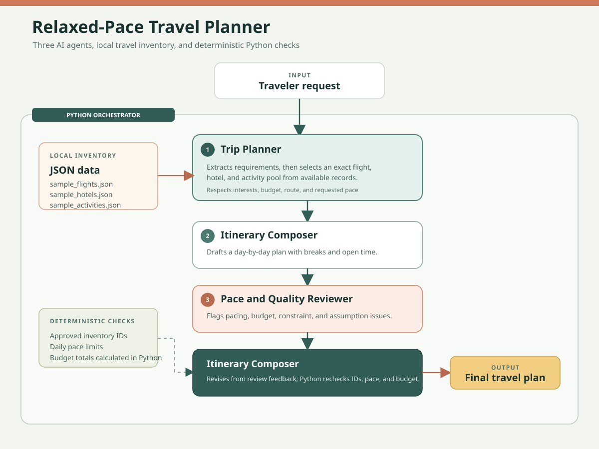

# Relaxed-Pace Multi-Agent Travel Planner

A multi-agent AI travel planner that creates and improves easygoing itineraries using specialized AI agents.

The project uses three AI agents coordinated by a small deterministic Python workflow. The Trip Planner extracts requirements and selects flights, hotels, and activities. The Itinerary Composer builds and revises the day-by-day schedule, while the Pace and Quality Reviewer independently checks it. Relaxed pacing is the default: each day has at most one main activity, with downtime and light arrival and departure days.

## Project Goal

The goal of this mini-project is to extend a basic multi-agent travel planner so that it creates realistic itineraries without packing every day with activities.

The Trip Planner favors activities tagged `relaxed-pace` or `easy-pace`. A deterministic Python check enforces a daily activity limit: one for relaxed, two for balanced, and three for packed itineraries.

## Architecture



[Download the architecture diagram](architecture.svg)

The OpenAI model performs the reasoning, while local JSON files provide sample flights, hotels, and activities. Prices, schedules, and options are illustrative mock data, not live travel availability or quotes.

## Relaxed-Pace Customization

The project is customized for travelers who value a slower trip:

* The Trip Planner records a `pace_preference`, defaulting to `relaxed`, and selects matching options from local inventory.
* Activity inventory uses `relaxed-pace`, `easy-pace`, and `full-day` tags to guide activity selection.
* The Itinerary Composer preserves breaks and keeps arrival and departure days especially light.
* The Pace and Quality Reviewer flags overfilled days and missing downtime; Python validation enforces the selected pace limit.

Example relaxed-pace request:

```text
Plan a relaxed 4-day trip from Delhi to Dubai for two people. Prefer food, city views, and cultural sites. Schedule no more than one main activity per day, leave generous breaks and unplanned time, and avoid red-eye flights.
```

## Project Structure

```text
relaxed_pace_travel_planner/
│
├── agents/
│   ├── trip_planner.py
│   ├── itinerary_composer.py
│   └── pace_quality_reviewer.py
│
├── tools/
│   └── travel_tools.py
│
├── data/
│   ├── sample_activities.json
│   ├── sample_hotels.json
│   └── sample_flights.json
│
├── models.py
├── utils.py
├── main.py
├── orchestrator.py
├── requirements.txt
├── .gitignore
└── README.md
```

## How the Agents Work

### Trip Planner

The planner first turns the user's request into structured requirements such as:

* Origin
* Destination
* Number of days
* Number of travellers
* Budget
* Travel preferences
* Requested pace (relaxed by default)

Uncertain details are recorded as assumptions rather than invented. It then selects a flight, hotel, and a small pool of activities from the local inventory, returning exact IDs and considering the route, timing, hotel budget, interests, and requested pace.

For relaxed trips, it prefers activities tagged:

```text
relaxed-pace
easy-pace
```

Python validation enforces the selected pace limit even if the language model returns an overfilled day.

### Itinerary Composer

The composer builds the day-by-day plan from the Trip Planner's approved options, then applies the reviewer's feedback without changing the grounded inventory.

### Pace and Quality Reviewer

The reviewer checks the draft for problems such as:

* Budget issues
* Overloaded days
* Unsupported assumptions
* Poor activity pacing

It provides actionable revision instructions without replacing inventory selections.

For relaxed trips, the auditor checks for more than one main activity per day, insufficient breaks, and overfilled arrival or departure days.

### Revision

The Itinerary Composer applies the review feedback. The orchestrator then validates IDs, day count, pace limits, and budget totals before returning the final plan.

## Setup

### Linux / Ubuntu

Create and activate a virtual environment:

```bash
python3 -m venv venv
source venv/bin/activate
```

Install the required packages:

```bash
pip install -r requirements.txt
```

### Windows PowerShell

Create and activate a virtual environment:

```powershell
python -m venv .venv
.\.venv\Scripts\Activate.ps1
```

Install the required packages:

```powershell
python -m pip install -r requirements.txt
```

## API Key

Create a `.env` file in the project root:

```text
OPENAI_API_KEY=your-key-here
OPENAI_MODEL=gpt-4o-mini
```

Never commit or share the real API key.

The `.gitignore` file excludes `.env` from Git.

## Running the Project

Run the default travel request:

```bash
python main.py
```

The program generates a final travel plan containing:

* Selected flight
* Selected hotel
* Daily activities
* Budget
* Tradeoffs
* Assumptions
* Changes made after critique
* Final notes

## Testing With a Custom Request

The application accepts a custom travel request using the `--request` argument.

Example:

```bash
python main.py --request "Plan a relaxed 4-day trip from Delhi to Dubai for two people. Prefer food, city views, and cultural sites. Schedule no more than one main activity per day, leave generous breaks and unplanned time, and avoid red-eye flights."
```

For a relaxed request, the Trip Planner can select lighter activities such as:

* Old Dubai souks and creek abra ride
* Al Fahidi heritage quarter
* Spice Souk and creekside food walk

depending on the agent's reasoning and the available local inventory.

## Viewing the Full Agent Trace

To see the intermediate agent outputs:

```bash
python main.py --show-trace
```

You can also combine a custom request with the full trace:

```bash
python main.py --request "Plan a relaxed 4-day trip from Delhi to Dubai for two people. Prefer food, city views, and cultural sites. Schedule no more than one main activity per day and leave generous breaks and unplanned time." --show-trace
```

The trace shows:

```text
Trip Planner extracts requirements
and selects flight, hotel, and activities
        |
        v
Draft itinerary by Itinerary Composer
        |
        v
Pace and Quality Reviewer feedback
        |
        v
Revision instructions
        |
        v
Final itinerary
```

## Example Activity Pace Tags

The local activity data marks options by the effort and time they tend to require:

```text
Old Dubai souks and creek abra ride
Tags: culture, food, walkable, low-cost, relaxed-pace

Al Fahidi heritage quarter
Tags: culture, history, walkable, easy-pace

Desert conservation safari
Tags: nature, adventure, premium, full-day
```

These tags help the Trip Planner choose suitable activities without overfilling the day.

## Technologies Used

* Python
* OpenAI API
* Pydantic
* Python-dotenv
* JSON
* Multi-Agent Architecture

## Key Concepts Demonstrated

This project demonstrates:

* Multi-agent AI architecture
* A three-agent workflow
* Tool-grounded agent decisions
* Structured outputs using Pydantic
* Independent review and refinement
* Revision / Reflexion-style improvement
* Pace-aware agent customization and deterministic schedule validation
* Local JSON data as tool results
* Command-line user requests

## Testing

Run the default relaxed-pace request with:

```bash
python main.py
```

A custom relaxed-pace request can be run with:

```bash
python main.py --request "Plan a relaxed 4-day trip from Delhi to Dubai for two people. Prefer food, city views, and cultural sites. Schedule no more than one main activity per day and leave generous breaks and unplanned time."
```

The complete pipeline was tested with:

```bash
python main.py --request "Plan a relaxed 4-day trip from Delhi to Dubai for two people. Prefer food, city views, and cultural sites. Schedule no more than one main activity per day and leave generous breaks and unplanned time." --show-trace
```

The test successfully demonstrated:

* Trip requirements and inventory selection
* Relaxed-pace activity selection and schedule validation
* Draft itinerary generation
* Independent review and final revision

## Conclusion

This project extends the base Multi-Agent Travel Planner into a relaxed-pace travel planning system.

The main customization is the pace-aware workflow: the Trip Planner favors lighter activities, the Itinerary Composer preserves downtime, and deterministic validation prevents relaxed itineraries from exceeding one main activity per day.

